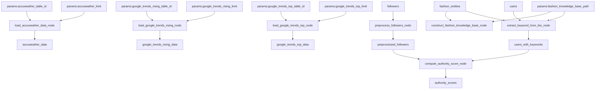

# topical-authority-discovery

[](https://kedro.org)

## Overview

This is your new Kedro project, which was generated using `kedro 0.19.12`.

Take a look at the [Kedro documentation](https://docs.kedro.org) to get started.

## Rules and guidelines

In order to get the best out of the template:

* Don't remove any lines from the `.gitignore` file we provide
* Make sure your results can be reproduced by following a [data engineering convention](https://docs.kedro.org/en/stable/faq/faq.html#what-is-data-engineering-convention)
* Don't commit data to your repository
* Don't commit any credentials or your local configuration to your repository. Keep all your credentials and local configuration in `conf/local/`

## How to install dependencies

Declare any dependencies in `requirements.txt` for `pip` installation.

To install them, run:

```
pip install -r requirements.txt
```

## How to run your Kedro pipeline

You can run your Kedro project with:

```
kedro run
```

## How to test your Kedro project

Have a look at the files `src/tests/test_run.py` and `src/tests/pipelines/data_science/test_pipeline.py` for instructions on how to write your tests. Run the tests as follows:

```
pytest
```

To configure the coverage threshold, look at the `.coveragerc` file.

## Project dependencies

To see and update the dependency requirements for your project use `requirements.txt`. You can install the project requirements with `pip install -r requirements.txt`.

[Further information about project dependencies](https://docs.kedro.org/en/stable/kedro_project_setup/dependencies.html#project-specific-dependencies)

## How to work with Kedro and notebooks

> Note: Using `kedro jupyter` or `kedro ipython` to run your notebook provides these variables in scope: `catalog`, `context`, `pipelines` and `session`.
>
> Jupyter, JupyterLab, and IPython are already included in the project requirements by default, so once you have run `pip install -r requirements.txt` you will not need to take any extra steps before you use them.

### Jupyter
To use Jupyter notebooks in your Kedro project, you need to install Jupyter:

```
pip install jupyter
```

After installing Jupyter, you can start a local notebook server:

```
kedro jupyter notebook
```

### JupyterLab
To use JupyterLab, you need to install it:

```
pip install jupyterlab
```

You can also start JupyterLab:

```
kedro jupyter lab
```

### IPython
And if you want to run an IPython session:

```
kedro ipython
```

### How to ignore notebook output cells in `git`
To automatically strip out all output cell contents before committing to `git`, you can use tools like [`nbstripout`](https://github.com/kynan/nbstripout). For example, you can add a hook in `.git/config` with `nbstripout --install`. This will run `nbstripout` before anything is committed to `git`.

> *Note:* Your output cells will be retained locally.

## Package your Kedro project

[Further information about building project documentation and packaging your project](https://docs.kedro.org/en/stable/tutorial/package_a_project.html)

# Topical Authority Discovery

This project implements a system for discovering topical authorities in social networks using the Fast Algorithm for Interest Propagation.

## Fast Algorithm for Interest Propagation

The algorithm computes authority scores for users in a social network based on their follower relationships and expressed interests. It works in three efficient passes over the follower graph:

### Input
- Follower graph G = (V,E): Directed graph where edge (u → v) means user u follows user v
- User interests: Topics extracted from user biographies and self-reported interests

### Algorithm Steps

1. **PASS 1: Explainable Authority Scores (Fe)**
   - Computes initial authority scores based on known interests
   - For each user v, calculates the fraction of their followers who are interested in each topic
   - Formula: Fe_v = (1/min_v) * ∑(u→v) Sc_u
   - Where min_v is the number of followers with expressed interests

2. **PASS 2: Broader Interests (Si)**
   - Infers interests for all users, including those without biographies
   - For each user u, averages the authority scores of users they follow
   - Formula: Si_u = (1/nout_u) * ∑(u→v) Fe_v
   - Where nout_u is the number of users u follows

3. **PASS 3: Broader Authority Scores (Fi)**
   - Computes final authority scores considering inferred interests
   - For each user v, averages the broader interests of their followers
   - Formula: Fi_v = (1/nin_v) * ∑(u→v) Si_u
   - Where nin_v is the number of followers of v

### Output
- Final authority score matrix F = Fe + Fi
- Each score F[t,v] represents user v's authority in topic t
- Higher scores indicate stronger authority in that topic

### Key Features
- Efficient: Requires only 3 passes over the graph
- Parallelizable: Each pass can be computed independently
- Explainable: Separates explainable (Fe) and broader (Fi) authority scores
- Scalable: Works with large social networks

## ALF Algorithm 1 Workflow Implementation

The project implements the complete ALF Algorithm 1 workflow as a series of Kedro pipeline nodes. This implementation follows the exact specifications from the ALF paper and provides configurable parameters for practical deployment.

### Workflow Nodes

The ALF Algorithm 1 workflow consists of four main nodes:

1. **`create_graph_and_initial_sc_node`** - Graph Construction
   - **Inputs**: `raw_follower_data`, `raw_user_interests`
   - **Outputs**: `graph`, `sc_matrix`, `topic_to_idx`, `user_to_idx`
   - **Function**: Creates NetworkX directed graph and initial topic interest matrix
   - **Tags**: `alf_workflow`, `graph_construction`

2. **`propagate_interests_node`** - Interest Propagation (Algorithm 1)
   - **Inputs**: `graph`, `sc_matrix`, `topic_to_idx`, `user_to_idx`, `params:alg_params`
   - **Outputs**: `f_matrix`
   - **Function**: Implements the three-pass algorithm for interest propagation
   - **Tags**: `alf_workflow`, `interest_propagation`

3. **`compute_authority_scores_node`** - Authority Score Computation
   - **Inputs**: `f_matrix`, `graph`, `topic_to_idx`, `user_to_idx`
   - **Outputs**: `wzf_matrix`, `zf_matrix`
   - **Function**: Computes normalized Z-scores and weighted Z-scores
   - **Tags**: `alf_workflow`, `authority_scoring`

4. **`assign_topical_authorities_node`** - Authority Assignment
   - **Inputs**: `wzf_matrix`, `f_matrix`, `zf_matrix`, `topic_to_idx`, `user_to_idx`, `params:alg_params`
   - **Outputs**: `final_authorities`
   - **Function**: Assigns final topical authorities and removes false positives
   - **Tags**: `alf_workflow`, `authority_assignment`

### Algorithm Parameters

The ALF algorithm parameters are configured in `conf/base/parameters_data_processing.yml`:

```yaml
alg_params:
  # Interest Propagation Parameters (Algorithm 1)
  alpha: 0.1      # Weight parameter for explainable authority (Fe)
  beta: 0.01      # Weight parameter for inferred authority (Fi) 
  gamma: 1.0      # Weight parameter for combining scores (F = alpha * Fe + beta * Fi)
  
  # Authority Assignment Parameters (Section 4.3.3)
  rho_mid: 0.5    # Mid-point parameter for popularity threshold (50th percentile)
  tau: 0.1        # Threshold parameter for filtering false positives
  k_top: 10       # Number of top scores for voting mechanism
```

These parameters follow the ALF paper recommendations:
- **alpha, beta, gamma**: Following Corollary 2 where beta << alpha << 1 and gamma = 1
- **rho_mid**: Controls the percentile for popularity-based threshold calculation
- **tau**: Additional threshold buffer for filtering low-scoring users
- **k_top**: Number of top users considered in the voting mechanism for FP2 removal

### Usage

1. Install dependencies:
```bash
uv sync
python -m spacy download en_core_web_sm
```

2. Run the complete pipeline (includes both legacy and ALF workflows):
```bash
kedro run
```

### ALF Algorithm 1 Workflow

For the new ALF Algorithm 1 workflow implementation:

```bash
# Run the complete ALF workflow
kedro run --tags alf_workflow

# Run individual ALF workflow steps
kedro run --tags graph_construction      # Step 1: Graph construction
kedro run --tags interest_propagation    # Step 2: Interest propagation
kedro run --tags authority_scoring       # Step 3: Authority scoring
kedro run --tags authority_assignment    # Step 4: Authority assignment

# Run with custom parameters
kedro run --tags alf_workflow --params alg_params.alpha:0.2,alg_params.beta:0.02

# Run with verbose logging
kedro run --tags alf_workflow --verbose
```

### Legacy Pipeline

For the original preprocessing pipeline:

```bash
# Run the complete legacy pipeline
kedro run --tags preprocessing

# Run individual legacy steps
kedro run --tags graph_construction      # Follower graph construction
kedro run --tags knowledge_base          # Fashion knowledge base construction
kedro run --tags keyword_extraction      # Keyword extraction from bios
kedro run --tags authority_discovery     # Authority score computation
```

The pipelines will:
1. Process follower relationships into a directed graph
2. Extract keywords from user biographies
3. Compute authority scores using the Fast Algorithm
4. Save results to `data/02_intermediate/authority_scores.parquet`

**ALF Workflow Output**: The new ALF workflow produces `final_authorities` with assigned topical authorities and their scores.

## Project Structure

```
topical-authority-discovery/
├── data/
│   ├── 01_raw/           # Raw input data including sample.ddb (DuckDB database)
│   ├── 02_intermediate/  # Processed data
│   └── 03_primary/       # Final output data
├── src/
│   └── topical_authority_discovery/
│       ├── pipelines/
│       │   └── data_processing/
│       │       ├── nodes.py      # Data processing nodes including BigQuery loading
│       │       └── pipeline.py   # Kedro pipeline definition
│       └── tests/
│           └── pipelines/
│               └── data_processing/
│                   └── test_nodes.py  # Unit tests for data processing nodes
├── conf/
│   ├── base/
│   │   ├── catalog.yml   # Data catalog configuration
│   │   └── parameters.yml # Pipeline parameters including BigQuery table IDs
│   └── local/
│       └── credentials.yml # Local credentials (git-ignored)
├── notebooks/            # Jupyter notebooks for analysis
├── .gitignore           # Git ignore rules
├── pyproject.toml       # Project metadata and dependencies
├── README.md           # Project documentation
└── requirements.txt    # Python package dependencies
```

Key files and their purposes:
- `data/01_raw/sample.ddb`: DuckDB database containing BigQuery data
- [`src/topical_authority_discovery/pipelines/data_processing/nodes.py`](src/topical_authority_discovery/pipelines/data_processing/nodes.py): Implementation of data loading and processing nodes
- [`src/topical_authority_discovery/pipelines/data_processing/pipeline.py`](src/topical_authority_discovery/pipelines/data_processing/pipeline.py): Kedro pipeline definition
- [`src/topical_authority_discovery/tests/pipelines/data_processing/test_nodes.py`](src/topical_authority_discovery/tests/pipelines/data_processing/test_nodes.py): Unit tests for data processing nodes
- [`conf/base/catalog.yml`](conf/base/catalog.yml): Data catalog configuration for DuckDB tables
- [`conf/base/parameters.yml`](conf/base/parameters.yml): Configuration for BigQuery table IDs and row limits
- `conf/local/credentials.yml`: GCP credentials for BigQuery access (not tracked in git)
- [`notebooks/`](notebooks/): Directory containing Jupyter notebooks for analysis
- [`.gitignore`](.gitignore): Git ignore rules
- [`pyproject.toml`](pyproject.toml): Project metadata and dependencies
- [`README.md`](README.md): Project documentation
- [`requirements.txt`](requirements.txt): Python package dependencies

## Usage

1. Install dependencies:
```bash
uv sync
python -m spacy download en_core_web_sm
```

2. Run the complete pipeline (includes both legacy and ALF workflows):
```bash
kedro run
```

### ALF Algorithm 1 Workflow

For the new ALF Algorithm 1 workflow implementation:

```bash
# Run the complete ALF workflow
kedro run --tags alf_workflow

# Run individual ALF workflow steps
kedro run --tags graph_construction      # Step 1: Graph construction
kedro run --tags interest_propagation    # Step 2: Interest propagation
kedro run --tags authority_scoring       # Step 3: Authority scoring
kedro run --tags authority_assignment    # Step 4: Authority assignment

# Run with custom parameters
kedro run --tags alf_workflow --params alg_params.alpha:0.2,alg_params.beta:0.02

# Run with verbose logging
kedro run --tags alf_workflow --verbose
```

### Legacy Pipeline

For the original preprocessing pipeline:

```bash
# Run the complete legacy pipeline
kedro run --tags preprocessing

# Run individual legacy steps
kedro run --tags graph_construction      # Follower graph construction
kedro run --tags knowledge_base          # Fashion knowledge base construction
kedro run --tags keyword_extraction      # Keyword extraction from bios
kedro run --tags authority_discovery     # Authority score computation
```

The pipelines will:
1. Process follower relationships into a directed graph
2. Extract keywords from user biographies
3. Compute authority scores using the Fast Algorithm
4. Save results to `data/02_intermediate/authority_scores.parquet`

**ALF Workflow Output**: The new ALF workflow produces `final_authorities` with assigned topical authorities and their scores.

## Preprocessing Pipeline

The project implements a series of preprocessing steps to prepare data for authority score computation:

1. **Follower Graph Construction** (`preprocess_followers_node`)
   - Input: Raw follower relationships
   - Output: Directed graph representation
   - Tags: `preprocessing`, `graph_construction`

2. **Fashion Knowledge Base Construction** (`construct_fashion_knowledge_base_node`)
   - Input: Fashion entities data and knowledge base path
   - Output: In-memory knowledge base (saved to disk)
   - Tags: `preprocessing`, `knowledge_base`

3. **Keyword Extraction** (`extract_keyword_from_bio_node`)
   - Input: User profiles and fashion knowledge base
   - Output: Users with extracted keywords and linked fashion entities
   - Tags: `preprocessing`, `keyword_extraction`

4. **Authority Score Computation** (`compute_authority_score_node`)
   - Input: Preprocessed follower graph and users with keywords
   - Output: Authority scores matrix
   - Tags: `authority_discovery`

### Pipeline Visualization

The pipeline dependencies can be visualized using Kedro-Viz:

```bash
kedro viz
```

This will open a web-based GUI showing the pipeline structure. The pipeline can also be represented in Mermaid format:



The pipeline consists of two main parts:
1. **Data Loading Pipeline**
   - Loads data from BigQuery into DuckDB
   - Creates three separate tables for different data sources
   - Uses parameters for table IDs and row limits

2. **Preprocessing Pipeline**
   - Processes follower relationships into a directed graph
   - Constructs a fashion knowledge base
   - Extracts keywords from user biographies
   - Computes authority scores

Each node is tagged for easy filtering and execution:
- `data_loading`: BigQuery data loading nodes
- `bigquery`: Nodes that interact with BigQuery
- `preprocessing`: Data preprocessing nodes
- `graph_construction`: Nodes that build the follower graph
- `knowledge_base`: Nodes that handle the fashion knowledge base
- `keyword_extraction`: Nodes that extract keywords from text
- `authority_discovery`: Nodes that compute authority scores

## Testing the Pipeline

The project includes comprehensive tests for each preprocessing step. To run tests with detailed console output:

1. **Run all preprocessing tests:**
```bash
pytest src/tests/pipelines/data_processing/test_nodes.py -k "preprocess_followers or construct_fashion_knowledge_base or extract_keyword_from_bio" -v -s
```

2. **Test follower graph construction:**
```bash
pytest src/tests/pipelines/data_processing/test_nodes.py -k "test_preprocess_followers" -v -s
```

3. **Test fashion knowledge base construction:**
```bash
pytest src/tests/pipelines/data_processing/test_nodes.py -k "test_construct_fashion_knowledge_base" -v -s
```

4. **Test keyword extraction and entity linking:**
```bash
pytest src/tests/pipelines/data_processing/test_nodes.py -k "test_link_fashion_entities" -v -s
```

5. **Test batch processing of entity linking:**
```bash
pytest src/tests/pipelines/data_processing/test_nodes.py -k "test_link_fashion_entities_batch_processing" -v -s
```

The `-s` flag ensures that all print statements are displayed in the console output, showing:
- Knowledge base construction steps
- Entity matching process
- Confidence scores
- Verification steps
- Test progress and results

Each test provides detailed output about:
- Input data processing
- Intermediate results
- Entity matching
- Confidence scores
- Verification steps
- Success/failure indicators

## Loading BigQuery Data into DuckDB

The project includes functionality to load data from BigQuery public datasets into a local DuckDB database. This is useful for working with large datasets without needing to download them entirely.

### Available Datasets

1. **AccuWeather Data**
   - Table: `accuweather-com.sample.sample`
   - DuckDB table: `accuweather_weather`

2. **Google Trends Rising Terms**
   - Table: `bigquery-public-data.google_trends.international_top_rising_terms`
   - DuckDB table: `google_trends_rising_terms`

3. **Google Trends Top Terms**
   - Table: `bigquery-public-data.google_trends.international_top_terms`
   - DuckDB table: `google_trends_top_terms`

### Loading Data

To load these datasets into DuckDB, run:

```bash
kedro run --pipeline=data_processing --nodes=load_accuweather_data_node,load_google_trends_rising_node,load_google_trends_top_node
```

This will:
1. Connect to BigQuery using your GCP credentials
2. Query each dataset with a limit of 100 rows (configurable in `parameters.yml`)
3. Load the data into DuckDB tables in `data/01_raw/sample.ddb`

### Viewing Data with DuckDB Web UI

DuckDB provides a web-based UI for exploring and querying your data. To use it:

1. **Install DuckDB** (if not already installed):
   ```bash
   # For macOS
   brew install duckdb
   
   # For Linux
   curl -L https://github.com/duckdb/duckdb/releases/latest/download/duckdb_cli-linux-amd64.zip -o duckdb.zip
   unzip duckdb.zip
   ```

2. **Start the Web UI**:
   ```bash
   # Navigate to your project directory
   cd /path/to/topical-authority-discovery
   
   # Start DuckDB Web UI with your database file
   duckdb -ui data/01_raw/sample.ddb
   ```

3. **Explore the data**:
   - The Web UI will open in your default browser
   - In the left sidebar, you'll see your tables:
     - `accuweather_weather`
     - `google_trends_rising_terms`
     - `google_trends_top_terms`
   - Click on any table to view its contents
   - Use the SQL editor to run custom queries

4. **Example queries**:
   ```sql
   -- View all tables
   SHOW TABLES;

   -- View AccuWeather data
   SELECT * FROM accuweather_weather LIMIT 10;

   -- View Google Trends rising terms
   SELECT * FROM google_trends_rising_terms LIMIT 10;

   -- View Google Trends top terms
   SELECT * FROM google_trends_top_terms LIMIT 10;
   ```

The DuckDB Web UI provides features like:
- Table browsing and filtering
- SQL query execution
- Data visualization
- Export capabilities
- Schema exploration

For more information about DuckDB Web UI, visit [DuckDB Web UI Documentation](https://duckdb.org/2025/03/12/duckdb-ui.html).
