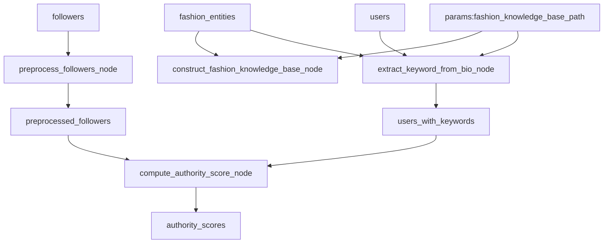

# topical-authority-discovery

[](https://kedro.org)

## Overview

This is your new Kedro project, which was generated using `kedro 0.19.12`.

Take a look at the [Kedro documentation](https://docs.kedro.org) to get started.

## Rules and guidelines

In order to get the best out of the template:

* Don't remove any lines from the `.gitignore` file we provide
* Make sure your results can be reproduced by following a [data engineering convention](https://docs.kedro.org/en/stable/faq/faq.html#what-is-data-engineering-convention)
* Don't commit data to your repository
* Don't commit any credentials or your local configuration to your repository. Keep all your credentials and local configuration in `conf/local/`

## How to install dependencies

Declare any dependencies in `requirements.txt` for `pip` installation.

To install them, run:

```
pip install -r requirements.txt
```

## How to run your Kedro pipeline

You can run your Kedro project with:

```
kedro run
```

## How to test your Kedro project

Have a look at the files `src/tests/test_run.py` and `src/tests/pipelines/data_science/test_pipeline.py` for instructions on how to write your tests. Run the tests as follows:

```
pytest
```

To configure the coverage threshold, look at the `.coveragerc` file.

## Project dependencies

To see and update the dependency requirements for your project use `requirements.txt`. You can install the project requirements with `pip install -r requirements.txt`.

[Further information about project dependencies](https://docs.kedro.org/en/stable/kedro_project_setup/dependencies.html#project-specific-dependencies)

## How to work with Kedro and notebooks

> Note: Using `kedro jupyter` or `kedro ipython` to run your notebook provides these variables in scope: `catalog`, `context`, `pipelines` and `session`.
>
> Jupyter, JupyterLab, and IPython are already included in the project requirements by default, so once you have run `pip install -r requirements.txt` you will not need to take any extra steps before you use them.

### Jupyter
To use Jupyter notebooks in your Kedro project, you need to install Jupyter:

```
pip install jupyter
```

After installing Jupyter, you can start a local notebook server:

```
kedro jupyter notebook
```

### JupyterLab
To use JupyterLab, you need to install it:

```
pip install jupyterlab
```

You can also start JupyterLab:

```
kedro jupyter lab
```

### IPython
And if you want to run an IPython session:

```
kedro ipython
```

### How to ignore notebook output cells in `git`
To automatically strip out all output cell contents before committing to `git`, you can use tools like [`nbstripout`](https://github.com/kynan/nbstripout). For example, you can add a hook in `.git/config` with `nbstripout --install`. This will run `nbstripout` before anything is committed to `git`.

> *Note:* Your output cells will be retained locally.

## Package your Kedro project

[Further information about building project documentation and packaging your project](https://docs.kedro.org/en/stable/tutorial/package_a_project.html)

# Topical Authority Discovery

This project implements a system for discovering topical authorities in social networks using the Fast Algorithm for Interest Propagation.

## Fast Algorithm for Interest Propagation

The algorithm computes authority scores for users in a social network based on their follower relationships and expressed interests. It works in three efficient passes over the follower graph:

### Input
- Follower graph G = (V,E): Directed graph where edge (u → v) means user u follows user v
- User interests: Topics extracted from user biographies and self-reported interests

### Algorithm Steps

1. **PASS 1: Explainable Authority Scores (Fe)**
   - Computes initial authority scores based on known interests
   - For each user v, calculates the fraction of their followers who are interested in each topic
   - Formula: Fe_v = (1/min_v) * ∑(u→v) Sc_u
   - Where min_v is the number of followers with expressed interests

2. **PASS 2: Broader Interests (Si)**
   - Infers interests for all users, including those without biographies
   - For each user u, averages the authority scores of users they follow
   - Formula: Si_u = (1/nout_u) * ∑(u→v) Fe_v
   - Where nout_u is the number of users u follows

3. **PASS 3: Broader Authority Scores (Fi)**
   - Computes final authority scores considering inferred interests
   - For each user v, averages the broader interests of their followers
   - Formula: Fi_v = (1/nin_v) * ∑(u→v) Si_u
   - Where nin_v is the number of followers of v

### Output
- Final authority score matrix F = Fe + Fi
- Each score F[t,v] represents user v's authority in topic t
- Higher scores indicate stronger authority in that topic

### Key Features
- Efficient: Requires only 3 passes over the graph
- Parallelizable: Each pass can be computed independently
- Explainable: Separates explainable (Fe) and broader (Fi) authority scores
- Scalable: Works with large social networks

## Project Structure

```
topical-authority-discovery/
├── data/
│   ├── 01_raw/           # Raw input data
│   ├── 02_intermediate/  # Processed data
│   └── 03_primary/       # Final output data
├── src/
│   └── topical_authority_discovery/
│       └── pipelines/
│           └── data_processing/
│               ├── nodes.py      # Algorithm implementation
│               └── pipeline.py   # Kedro pipeline definition
└── conf/
    └── base/
        └── catalog.yml   # Data catalog configuration
```

## Usage

1. Install dependencies:
```bash
uv sync
python -m spacy download en_core_web_sm
```

2. Run the pipeline:
```bash
kedro run
```

The pipeline will:
1. Process follower relationships into a directed graph
2. Extract keywords from user biographies
3. Compute authority scores using the Fast Algorithm
4. Save results to `data/02_intermediate/authority_scores.parquet`

## Preprocessing Pipeline

The project implements a series of preprocessing steps to prepare data for authority score computation:

1. **Follower Graph Construction** (`preprocess_followers_node`)
   - Input: Raw follower relationships
   - Output: Directed graph representation
   - Tags: `preprocessing`, `graph_construction`

2. **Fashion Knowledge Base Construction** (`construct_fashion_knowledge_base_node`)
   - Input: Fashion entities data and knowledge base path
   - Output: In-memory knowledge base (saved to disk)
   - Tags: `preprocessing`, `knowledge_base`

3. **Keyword Extraction** (`extract_keyword_from_bio_node`)
   - Input: User profiles and fashion knowledge base
   - Output: Users with extracted keywords and linked fashion entities
   - Tags: `preprocessing`, `keyword_extraction`

4. **Authority Score Computation** (`compute_authority_score_node`)
   - Input: Preprocessed follower graph and users with keywords
   - Output: Authority scores matrix
   - Tags: `authority_discovery`

### Pipeline Visualization

The pipeline dependencies can be visualized using Kedro-Viz:

```bash
kedro viz
```

This will open a web-based GUI showing the pipeline structure. The pipeline can also be represented in Mermaid format:



## Testing the Pipeline

The project includes comprehensive tests for each preprocessing step. To run tests with detailed console output:

1. **Run all preprocessing tests:**
```bash
pytest src/tests/pipelines/data_processing/test_nodes.py -k "preprocess_followers or construct_fashion_knowledge_base or extract_keyword_from_bio" -v -s
```

2. **Test follower graph construction:**
```bash
pytest src/tests/pipelines/data_processing/test_nodes.py -k "test_preprocess_followers" -v -s
```

3. **Test fashion knowledge base construction:**
```bash
pytest src/tests/pipelines/data_processing/test_nodes.py -k "test_construct_fashion_knowledge_base" -v -s
```

4. **Test keyword extraction and entity linking:**
```bash
pytest src/tests/pipelines/data_processing/test_nodes.py -k "test_link_fashion_entities" -v -s
```

5. **Test batch processing of entity linking:**
```bash
pytest src/tests/pipelines/data_processing/test_nodes.py -k "test_link_fashion_entities_batch_processing" -v -s
```

The `-s` flag ensures that all print statements are displayed in the console output, showing:
- Knowledge base construction steps
- Entity matching process
- Confidence scores
- Verification steps
- Test progress and results

Each test provides detailed output about:
- Input data processing
- Intermediate results
- Entity matching
- Confidence scores
- Verification steps
- Success/failure indicators
